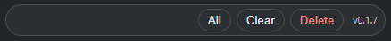

# NotebookLM Source Bulk Delete

A lightweight Chrome/Edge extension for deleting multiple sources from the current Google NotebookLM notebook.

This is a local-first MVP. It uses page automation against the NotebookLM web UI instead of private NotebookLM APIs.

> Not affiliated with, endorsed by, or sponsored by Google or NotebookLM.

## The Problem

NotebookLM makes it very easy to add a lot of sources quickly. A web search, Fast Research run, Deep Research run, or bulk import session can leave a notebook with dozens of pages, PDFs, transcripts, images, and notes.

That is useful while exploring, but painful after you have extracted what you need. You might summarize, compress, or synthesize those raw sources into a cleaner note, then want to remove the original imported sources. NotebookLM still makes that cleanup mostly one source at a time: open the source menu, delete, confirm, wait, repeat.

This extension adds a small toolbar for selecting and deleting multiple visible sources with confirmation and progress tracking.

## Demo

### Toolbar

The extension adds a compact toolbar under `Add sources`: `All` selects visible sources, `Clear` clears selected sources, and `Delete` starts the confirmed batch-delete flow.



### Before: one-by-one cleanup


### After: batch delete flow


## Features

- Runs only on `https://notebooklm.google.com/*`.
- Adds a compact `All / Clear / Delete` toolbar to the NotebookLM source panel.
- Reuses NotebookLM's native source checkboxes.
- Deletes selected sources sequentially through the NotebookLM UI.
- Shows a confirmation list before deleting.
- Shows progress, cancellation, and final summary.
- Does not collect telemetry.
- Does not upload source names or contents.
- Does not store Google account cookies.

## Current Status

This is an early MVP for personal use and testing. It has been validated on a real NotebookLM notebook, but NotebookLM may change its DOM. Re-test after NotebookLM UI updates.

## Install Locally

Clone the repo and build the extension:

```bash
npm install
npm run build
```

Load it as an unpacked extension:

1. Open Chrome or Edge.
2. Go to `chrome://extensions` or `edge://extensions`.
3. Enable Developer mode.
4. Click Load unpacked.
5. Select the `extension` folder.
6. Open a NotebookLM notebook.

The toolbar should appear under `Add sources` in the source panel.

## Usage

Use a disposable test notebook first.

1. Open a NotebookLM notebook.
2. Click `All` to select visible sources, or select sources manually.
3. Click `Clear` to clear selected sources.
4. Click `Delete` to delete selected sources.
5. Review the confirmation list.
6. Confirm deletion.
7. Wait for the summary.

Original Google Drive files are not deleted. Sources are removed from the current NotebookLM notebook.

## Troubleshooting

If the toolbar does not appear:

1. Run `npm run build`.
2. Reload the unpacked extension.
3. Refresh the NotebookLM notebook page.

If selection or deletion stops working after a NotebookLM UI update, open DevTools on the NotebookLM page and run:

```js
window.nlmbdDebug()
```

The debug output only inspects the current page DOM. It does not send data anywhere.

## Development

Install dependencies:

```bash
npm install
```

Run unit tests:

```bash
npm test
```

Run fixture E2E tests. This builds the content script first:

```bash
npm run test:e2e
```

Run all tests:

```bash
npm run test:all
```

Build the extension content bundle:

```bash
npm run build
```

## Release Package

Build the extension, then zip the contents of the `extension` folder. The zip root must contain `manifest.json`.

On Windows PowerShell:

```powershell
npm run package:extension
```

Upload `release/notebooklm-source-bulk-delete-0.1.0.zip` to the Chrome Web Store Developer Dashboard or Microsoft Partner Center.

## Privacy

See [PRIVACY.md](./PRIVACY.md).

Short version: the extension runs locally in your browser, does not send analytics, does not upload NotebookLM data, and does not store Google cookies.

## Project Documents

- [PRD.md](./PRD.md)
- [SPEC.md](./SPEC.md)
- [CHANGELOG.md](./CHANGELOG.md)
- [CONTRIBUTING.md](./CONTRIBUTING.md)

## License

MIT. See [LICENSE](./LICENSE).
